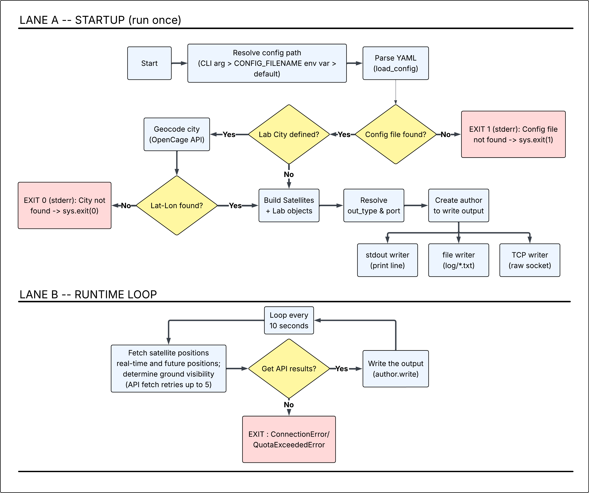

[](https://github.com/Xploror/satellite-pass-app/actions/workflows/ci.yml) [](https://github.com/Xploror/satellite-pass-app/actions/workflows/test-coverage.yml)

# Satellite-Pass-App

This python application issues commands when specified satellites are passing over a specified location.

## Table of contents

- [Overview](#overview)
    - [Application Flow](#application-flow)
    - [Repository Layout](#repository-layout)
- [Installation](#installation)
    - [Local development](#local-development)
    - [Docker container deployment](#docker-container-deployment)
    - [Environment variables](#environment-variables)
- [Tool Settings](#tool-settings)
- [Implementation](#implementation)
    - [Writing configuration files](#writing-configuration-files)
    - [Understanding output](#understanding-output)
- [Example](#example)
- [Debugging](#debugging)
- [Optional Task](#optional-task)
    - [Multi-Stage Dev & Prod Environment](#multi-stage-dev--prod-environment)
        - [Docker Compose Layout](#docker-compose-layout)
    - [Future Plans for Deployment/Maintainence](#future-plans-for-deploymentmaintainence)
- [AI Disclosure](#ai-disclosure)

## Overview

This application runs based on the initial inputs provided in a configuration file and supports three different kinds of output styles giving real-time information on passing satellites of interest.

The solution involves calling all the satellites with their respective NORAD ID as an API call that provides the positional and elevation angle information. The elevation angle from the response is enough to compare with the minimum elevation angle of the Lab to determine if the corresponding satellite is visible to the Lab or not.

All the library functions are included in the **lib** folder, configuration files in the **config_files** folder, and pytest testing script in the **tests** folder. The *main.py* script systematically calls necessary modules to parse the configuration file, create necessary objects, call necessary APIs and write the outputs accordingly. 

### Application Flow



*Configuration is resolved, satellites and lab are loaded, an output writer is created once, then the app loops every 10 seconds fetching satellite positions and reporting visibility.*

### Repository Layout

```
satellite-pass-app/
├── Dockerfile                  # All docker instructions
├── Makefile                    # All make instructions
├── requirements.txt            # Contains all necessary packages for the project
├── main.py                     # Main file for the application
├── config_files/               # Stores all the YAML configuration files for the application
│   ├── conf_default.yaml       # Default configuration file
│   ├── .
│   ├── .
│   └── .
├── lib/                        # Stores all the library functions for the application
│   ├── __init__.py             # Artifact for lib package
│   ├── config.py               # Stores methods to configure application based on the input YAML file
│   ├── output.py               # Stores methods for supported application outputs
│   ├── systems.py              # Stores intermediate classes for satellite and lab
│   └── utils.py                # Stores logic for various API calls supported by the application
└── tests/                      # unittest folder
    └── test_myscripts.py       # pytest file for the application
```

Check the steps of implementation [here](#implementation). Refer to the [example](#example) and the [debugging](#debugging) section for any help navigating the project.

## Installation

To set up the satellite-pass-app, there are two ways:

### Local development

The *Makefile* contains necessary instructions to build, test and run the project as follows:

1. Clone the satellite-pass-app repository:
```
git clone https://github.com/Xploror/satellite-pass-app.git
```

2. Enter the project folder and install necessary packages in the virtual environment:
```
make install
```

3. Run necessary functional tests on the project (recommended for first use):
```
make test
```

4. After successful test execution. Execute the project using `make run`. Note that this would only run the project using the default configuration in the *conf_default.yaml* file. To [use a different configuration file](#writing-configuration-files) add the `ARGS` argument as
```
make run ARGS="<relative/path/of/configfile>"
```
An example is:
```
make run ARGS="config_files/conf_test1"
```

Additionally, the path of the desirable configuration file can be also specified in the environment variable `CONFIG_FILENAME`

### Docker container deployment

The *Dockerfile* contains necessary instructions to build a simple image and run the container as follows:

1. Clone the satellite-pass-app repository:
```
git clone https://github.com/Xploror/satellite-pass-app.git
```

2. Enter the project folder and build the image as:
```
docker build -t satellite-pass-app .
```

3. Run necessary functional tests on the project (recommended for first use):
```
docker run -e N2YO_APIKEY=[your-N2YO-api] -e ANTHROPIC_APIKEY=[your-anthropic-api] --rm -it satellite-pass-app pytest -q
```

4. Run the container using the built docker image over default settings as:
```
docker run -e N2YO_APIKEY=[your-N2YO-api] -e ANTHROPIC_APIKEY=[your-anthropic-api] --rm -it satellite-pass-app
```

By default the container refers to the environment variables APP_HOST=0.0.0.0 and APP_PORT=80 as default container port address that is served. Docker's port mapping can be used to externally channel data outside the container since the port 80 is exposed.

Since the application allows command arguments and environment variables to have smoother selection of configuration files and output attributes, the `docker run` is enough to run an updated configuration file instead of building the image everytime for new updates in the configuraiton files. For example, if the file *conf_test1.yaml* has to be used with output_type 3 (HTTPServer) and selecting the port as `12345`, then the command looks like:
```
docker run --rm -it -p 12345:80 satellite-pass-app config_files/conf_test1 3
```
Access the data on localhost:12345 using
```
curl http://localhost:12345
```

> NOTE: Makefile is also configured to build the docker image, run the unittest and run the respective container using the tags `docker-build`, `docker-test`, and `docker-run`.

#### Environment Variables

Below are the environment variables that can be configured in `Dockerfile` and/or `docker-compose.yml` for the application. 

| Environment Variables | Type | Default values |
| :-------------------: | :--: | :------------: |
| CONFIG_FILENAME | string | config_files/conf_default | 
| APP_OUTFILE | string | output | 
| APP_HOST | string | 127.0.0.1 | 
| APP_PORT | int | 12346 | 

## Tool Settings

Tooling for tests, type checking, and linting/formatting is centrally configured in `pyproject.toml`. These are the same checks run by `make test` / `make lint` / `make typecheck`, `.github/workflows/ci.yml`, and the Docker `development` stage.

### Pytest

`[tool.pytest.ini_options]`

| Setting | Value | What it does |
| :--- | :--- | :--- |
| `pythonpath` | `["."]` | Adds the project root to `sys.path` so tests can `import lib` without installing the project as a package |
| `testpaths` | `["tests"]` | Restricts test discovery to the `tests/` folder |

Run via `make test` or `pytest -q`.

### Mypy

`[tool.mypy]`

| Setting | Value | What it does |
| :--- | :--- | :--- |
| `python_version` | `"3.12"` | Matches the project's runtime Python version, so stdlib type stubs are checked accurately |
| `ignore_missing_imports` | `true` | Suppresses errors for third-party packages that ship no type stubs (e.g. `opencage` (now doesnt exist in the project)) |
| `check_untyped_defs` | `true` | Type-checks function bodies even when they lack full type annotations, without requiring the whole codebase to be annotated |

Run via `make typecheck` or `mypy lib`.

> NOTE: If **ignore_missing_imports** is set **false** but specific packages need to be ignored, then add **# type: ignore** on the corresponding import line

### Ruff (lint)

`[tool.ruff]` / `[tool.ruff.lint]`

| Setting | Value | What it does |
| :--- | :--- | :--- |
| `line-length` | `100` | Maximum line length enforced by lint and format checks |
| `target-version` | `"py312"` | Lets ruff apply Python 3.12-aware syntax checks |
| `select` | `["E", "F", "I"]` | Enables pycodestyle errors (`E`), Pyflakes for unused imports/undefined names (`F`), and isort-style import ordering (`I`) |

Run via `make lint` or `ruff check .`.

### Ruff (format)

`[tool.ruff.format]`

| Setting | Value | What it does |
| :--- | :--- | :--- |
| `quote-style` | `"double"` | Enforces double quotes when auto-formatting |

Run via `make lint` or `ruff format --check .`.

## Implementation

### Command Line Interface

Command line interface is the top priority for the application that can override properties described in the targetted YAML file. For example the `out_type` and `port` variables first priority is the Command Line inputs and if only not-specified in teh CLI, it searches the values from YAML file or environemnt variables.

### Writing configuration files

The YAML configuration file is subdivided into `Assets`, `Lab` and `Output` attributes.

- Assets: Contain details of the desired satellites. Each Nth satellite entry should be keyed as SatN and each such satellite contains two properties, ID and Color
    - ID (Integer): Unique ID of the satellite equivalent to the assigned NORAD ID.
    - Color (String): Unique color scheme for this satellite that should be displayed when the satellite is visible to the lab i.e within the lab's field of view.

- Lab: Contain details of the desired observation lab. Each lab has following properties:
    - City (String): Because this project uses the `opengate` API to search geolocations for cities, a lab can be simply located with just its city name if latitude and longitude values are not known. The existence of a non-empty value for City overrides Latitude and Longitude properties!
    - Latitude (Float): Exact latitude of the Lab in degrees.
    - Longitude (Float): Exact longitude of the Lab in degrees.
    - min_elevation (Float): Minimum elevation angle of the Lab in degrees. Range is 0 to 90 degrees.

- Output (Integer): Desirable output type. Supports three types of output - Terminal output, File output and HTTPServer output. 

This application has other means of taking inputs apart from the YAML files and the table below shows preferences from highest to lowest order that explains how the application prioritizes input style for the respective input variable.

| Input Variables | Type | Preferences |
| :-------------------: | :--: | :---------: |
| configuration file path | string | CLI, ENV_VAR |
| output type | int | CLI, YAML |
| port (backup=8080) | int | CLI, ENV_VAR |
| host | string | ENV_VAR |

> NOTE: Claude.ai API is called in the project session if the lab city name needs to be automatically parsed for its latitude and longitude, therefore for accurate location, please provide city name and possibly state/province and country, if multiple cities exist with the same name. NEEDS credits on your Claude Console to run this feature otherwise directly input the latitude and longitude.

### Understanding output

The output has a specific format that represents which satellites are visible and not visible. `<ID>:<color>` is shown as an output for only those satellites that are visible to the Lab at the very moment. `<ID>: NOT PASSING` is shown as an output for rest of the satellites not visible to the Lab at the very moment.

Additionally both File output and HTTPServer output type contains a timestamp before the actual data to represent the updates at every 10 seconds.

> NOTE: The default output file is located in *log/output.txt*. The file and this respective output folder is created during the FileWriter object instantiation inside *lib/output.py*.

> NOTE: The default HTTPServer output type host is `127.0.0.1` and port is `12346`.

## Example

The default configuration file contains 4 satellite assets with their respective ID and color. The Lab is located at Blacksburg (my ~~current~~ recent location) with minimum elevation angle as 0 degrees. For most of the time the terminal output would look like:
```
25544: NOT PASSING
63733: NOT PASSING
45198: NOT PASSING
45098: NOT PASSING
```
when let's say it sees `63733` and `45098`, then it shows:
```
25544: NOT PASSING
63733: Green
45198: NOT PASSING
45098: Maroon
```

For both File and HTTPServer outputs, it would look as follows:
```
[2026-07-27 01:18:35]
25544: NOT PASSING
63733: Green
45198: NOT PASSING
45098: Maroon
```

## Debugging

Usually when using HTTPServer connection output type, the default port address might be already in use and the project would throw a runtime error. This could be tackled by obtaining the PID for the process using the port address and manually killing the process using two steps:

Determine the PID:
```
sudo lsof -i :12346
```

Once the PID is determined, kill the proces using:
```
sudo kill -9 <PID>
```

This would free the port and would successfully run the project when using the HTTPServer output type.

## Discussion

<!-- As a long-term project, I would utilize the API more efficiently rather than calling it every 10 seconds and comparing the elevation angle. I would also create a better frontend for more user-friendly configuration rather than filling out the YAML file where I can add additional functionalities such as enabling lighting constraints on satellites and lab, or scaling the satellite pass logic on a group of labs with their respective color codings. I would also create a nice visualization of labs around the Earth and the respective satellites as dots updating its position with time and representing link colors based on the color scheme. -->

One of the biggest weakpoint of this application is its reliance on a third party database and a constant network access. In future work, I would most preferably target this specific vulnerability and develop robustness such as importing crucial data of desired satellites like TLEs, access intervals for next few days/weeks/months and keep SGP4 propagator ready for propagation through TLE after imported information expires.

Another useful feature can be the broadcasting of output to multiple hosts (endpoints) in a local network. Making this run in the production environment while maintaining the security!

## OPTIONAL TASK 

### MULTI-STAGE DEV & PROD ENVIRONMENT

The application can be built for the development and production stage using the instructions from the `Dockerfile`. The development environment provides root privilages, installs necessary development tools and runs unit tests while building the image. The production environment creates a non-root user and give them ownsership to the working directory. 

Development and Production images can be individually built as:
```
docker build --target development -t satellite-pass-app:dev
docker build --target production -t satellite-pass-app:prod
```

The recommended option for building and running both development and production isolated environment is using the `docker-compose.yml` file which automatically references the `Dockerfile` for built instructions along with setting environment variables and necessary ports for individual containers. Simply run the following command to build and start the containers:
```
docker compose up
```

Run the following command to stop all the containers:
```
docker compose stop
```

Run the following command to stop and remove the containers:
```
docker compose down
```

#### Docker compose layout

```
services
├── app-dev                                                 # Development service
│   ├── build                                   
│   ├── image: satellite-pass-app:dev
│   ├── environment
│   │    ├── APP_HOST: 0.0.0.0
│   │    ├── APP_PORT: 80
│   │    └── CONFIG_FILENAME: config_files/conf_test1
│   ├── ports
│   │    └── 12346:80
│   └── command: <optionl>
└── app-prod                                                # Production service
│   ├── build                                   
│   ├── image: satellite-pass-app:prod
│   ├── environment
│   │    ├── APP_HOST: 0.0.0.0
│   │    ├── APP_PORT: 60
│   │    └── CONFIG_FILENAME: config_files/conf_default
│   ├── ports
│   │    ├── 12345:60
│   │    └── 5000:60
│   └── command: <optional>
```

> NOTE: While running `docker compose up`, the development container runs the `conf_test1` YAML file with File output type and production container runs default YAML file with HTTPServer output type.

<!-- ### FUTURE PLANS FOR DEPLOYMENT/MAINTAINENCE

As a future development, I would prefer maintaining this project as a Github project with traditional feature branches for individual developers and have an additional staging branch (non-main) where all the final stable features can be pushed from all the developers which can be further passed to the main branch for production ready using Github workflow with push and PR events on main. The desirable actions I would like for this project would be running all the unittests, linting, build and publishing the container.  -->

## AI Disclosure

This project was developed with the support of AI-assisted development tools. Including Github Copilot and Claude. These tools were used throughout the development process to help investigate implementation challenges, resolve conflicting approaches, explore alternative solutions, and iteratively refine design decisions through technical critiques.

AI-generated suggestions were evaluated, tested, and adapted before being incorporated into the codebase. While these tools contributed ideas, code suggestions, and design feedbacks, all architectural decisions, implementation choices, testing, and final code review were perfromed by a human (me). I remain responsible for the correctness, quality, and maintainability of the project in future. 
